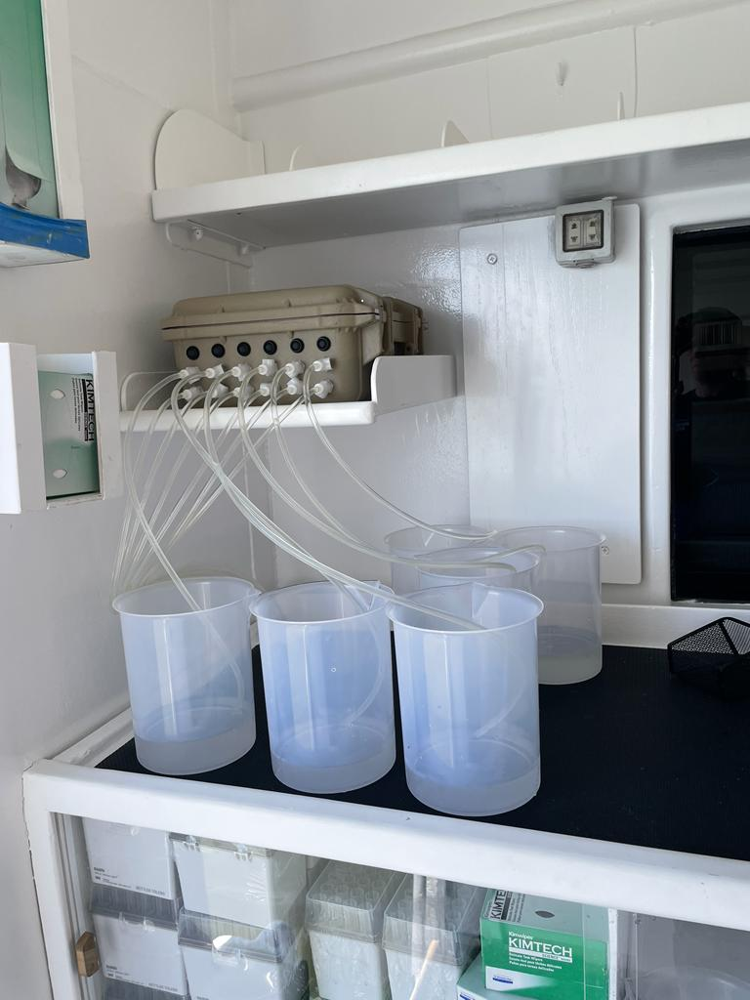
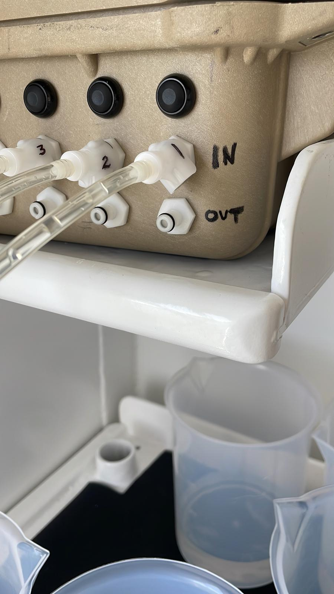

```{r}
#| include: false
library(tidyverse)
library(here)
library(knitr)
library(gt)
```

## Introduction

Nearshore water samples for eDNA are collected in tandem with the underwater survey team.....


## Method Overview

## Implementation

### Water Collection

### Water Filtration

{fig-alt="eDNA pump system" fig-align="center" width="80%"}

{fig-alt="Inflow and Outflow tubes" fig-align="center" width="80%"}

### Filter Preservation

## Lab Processing

### Extraction

### Library Prep

### Bioinformatics

## 
