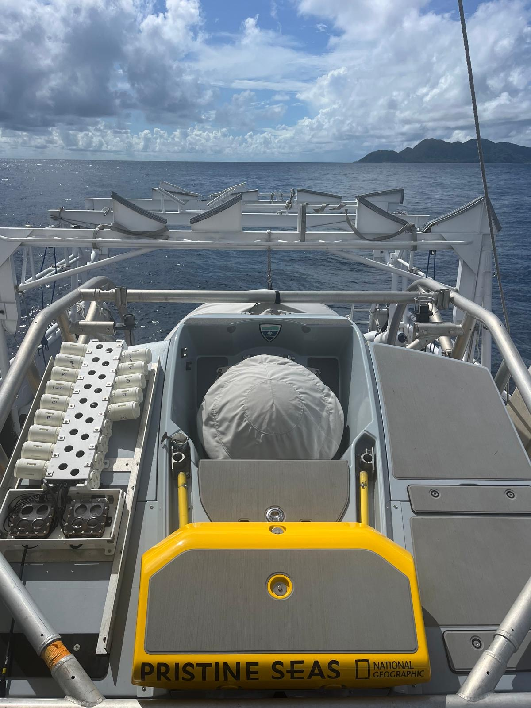

```{r}
#| include: false
library(tidyverse)
library(here)
library(knitr)
library(gt)
```

## Introduction

Submarine collections....

 {fig-alt="Aquatics Labs Multipuffer System on Argonauta" fig-align="center" width="80%"}

## Method Overview

## Implementation

### Water Collection

### Water Filtration

### Filter Preservation

## Lab and Informatic Processing

Samples are shipped to Wilderlab for laboratory and informatic processing - https://wilderlab.co/

## 
